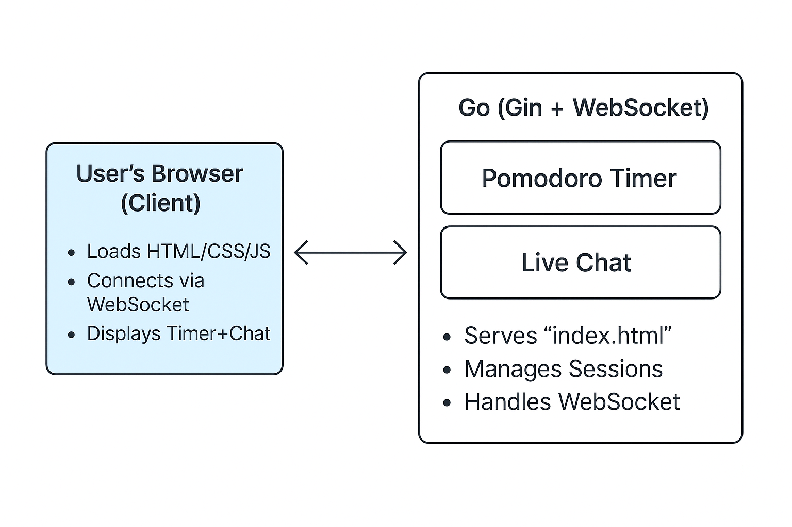
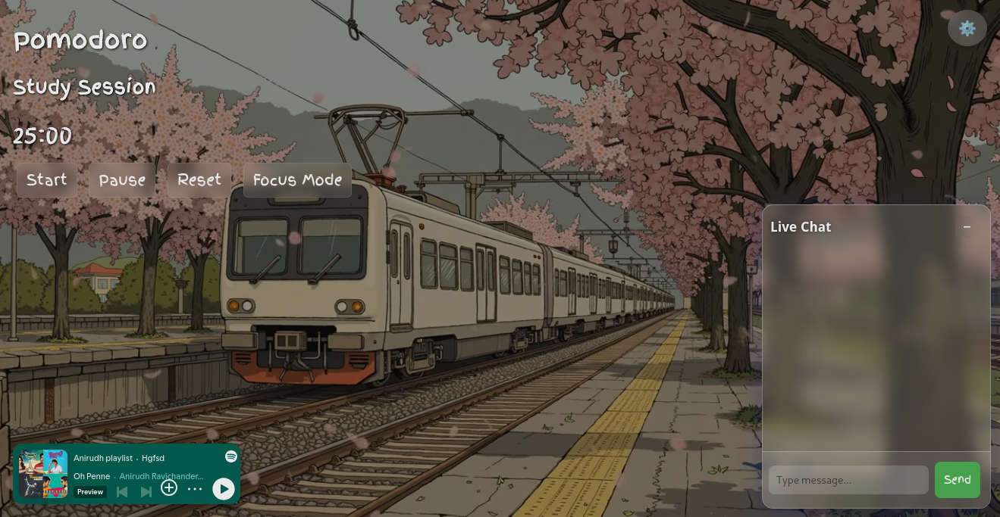

⏱️ Pomodoro App with Live Chat

A minimal and real-time Pomodoro timer app built with Go using the Gin framework and Gorilla WebSocket. Users can join a shared Pomodoro session and chat live with others—perfect for virtual co-working or focus groups.

🌟 Features

    ✅ Pomodoro Timer (25-min work / 5-min break)

    🔁 Automatic Cycle Switching

    💬 Real-Time Group Chat

    🔌 WebSocket Integration

    🧠 Built with Go Routines and Channels

🧱 Tech Stack

  Layer               Tech
Backend     -->  Go, Gin Framework
Realtime    -->  Gorilla WebSocket
Frontend    -->  Vanilla HTML, CSS, JavaScript
Concurrency -->  Go Routines & Channels

🚀 Getting Started
1. Clone the Repository

git clone https://github.com/your-username/pomodoro-live-chat.git
cd pomodoro-live-chat

2. Install Go Modules

go mod tidy

3. Run the Application

go run main.go

